WormNav
===================================

## User Guide

This project provides a simple 'worm' navigation feature for selected Garmin devices.
It consists of two apps:
- An Android companion app to manage GPX tracks and routes and send them to the Garmin device via bluetooth.
- The ConnectIQ app for the Garmin device to navigate along the track and run activities.

### Installation and basic set-up
- Install [WormNav Companion app](https://play.google.com/store/apps/details?id=org.andan.android.connectiq.wormnav) from Google Play Store on your Android smartphone or tablet
- If not already done, install [Garmin Connect™ app](https://play.google.com/store/apps/details?id=com.garmin.android.apps.connectmobile) from Google Play Store
- Install [WormNav app](https://apps.garmin.com/de-DE/apps/07c0363a-a921-4c77-bb4f-93a6d6c4a2ed) from Connect IQ Store
- Connect your Gamin device with your Android smartphone/tablet via bluetooth

### Usage scenario
1. Choose or create a GPX track or route you would like to use for navigation with your Garmin device
2. Import this track/route into WormNav Companion app
3. Optimize the track/route to reduce number of waypoints
4. Connect your Garmin device with your smartphone/tablet via bluetooth
4. Send optimized track/route to connected Garmin device
5. Start activity on Garmin device
6. Follow shown track on Garmin device
7. Stop/resume/save activity

### Companion app

#### Key features and capabilities:
- Load GPX tracks and routes
- Show GPX tracks or routes in Open Street map
- Optimize routes (reduce number of waypoints given maximum error contraint)
- Store tracks and routes
- Send track/route to connected Garmin device

#### Screens

##### First run/Main screen
{::options parse_block_html="true" /}

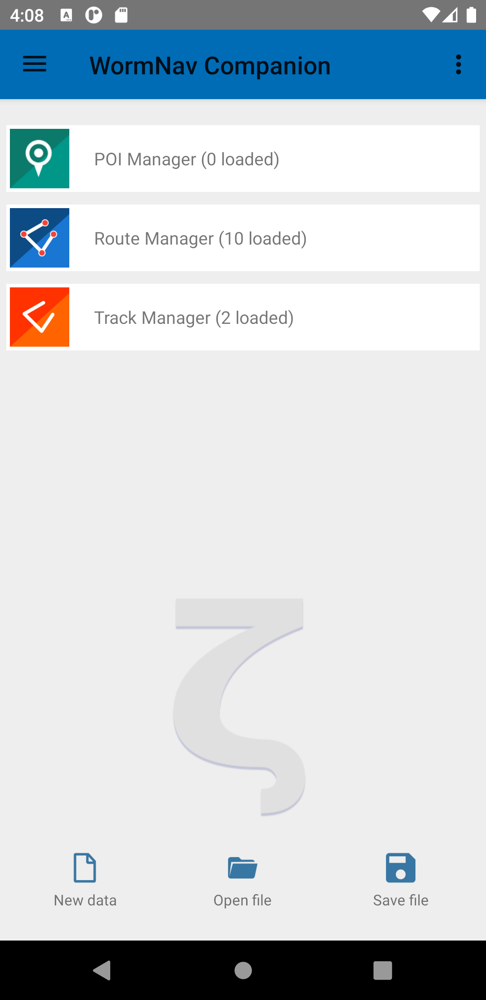

{::options parse_block_html="true" /}

- On first run the app will ask to grant two permissions (STORAGE and LOCATION).
- Also the app will try to create a 'WormNav' subfolder in the external storage location that can be used to store all GPX files in one location. 
Of course, other accessible locations can also be used.
- Main functions available from the main screen:
    - Manage settings
    - Load or save GPX file with possibly multiple tracks or routes. If 'Open last loaded/saved file" is enabled in the settings (default), 
    the last loaded or saved GPX file will be opened on app start.
    - Manage loaded GPX tracks, routes, or points of interest (see below)

{::options parse_block_html="true" /}

##### Track/Route Manager - Import

{::options parse_block_html="true" /}

- Import GPX tracks or routes
- Delete loaded GPX tracks or routes
- The 'Save file' function will save all loaded tracks and routes into a single GPX file

{::options parse_block_html="true" /}

##### Track/Route Manager - Show tracks/routes on map

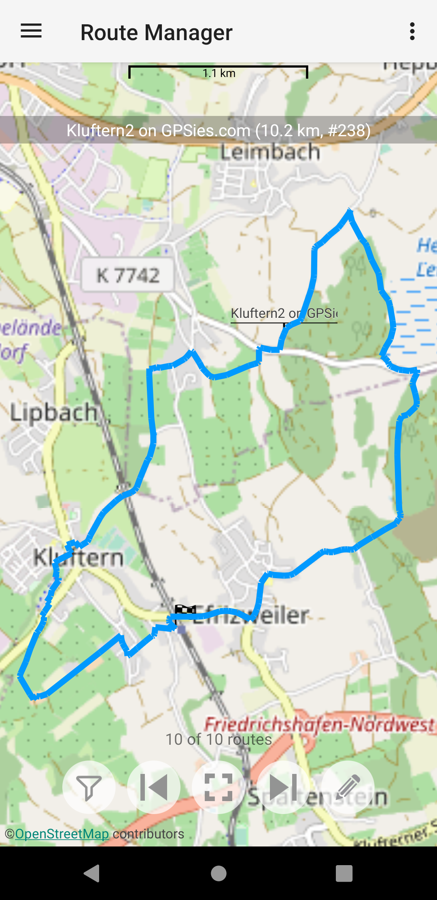

{::options parse_block_html="true" /}

- Show loaded tracks or routes on OpenStreet Map
- Select track/route by using arrows at screen buttom

{::options parse_block_html="true" /}

##### Route Manager - Optimize

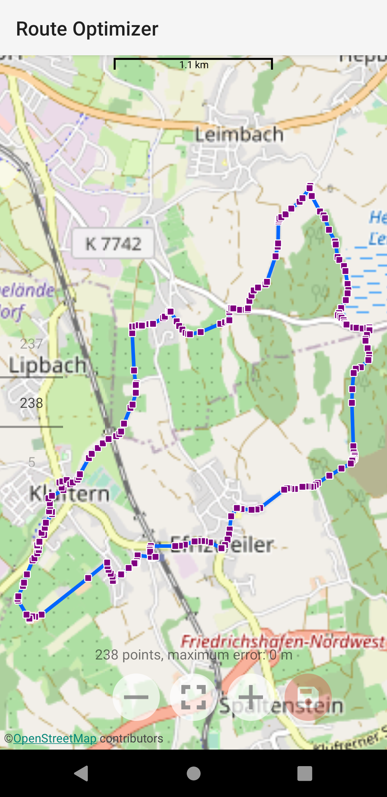

{::options parse_block_html="true" /}

- Optimize route by reducing number of waypoints
- Shows maximum error caused by optimization
- Useful for performance reasons on low spec devices
- Recommendation for Garmin Forerunner 230/235: max 200 waypoints
- Tracks must be converted into routes for optimization

{::options parse_block_html="true" /}

##### Device Browser

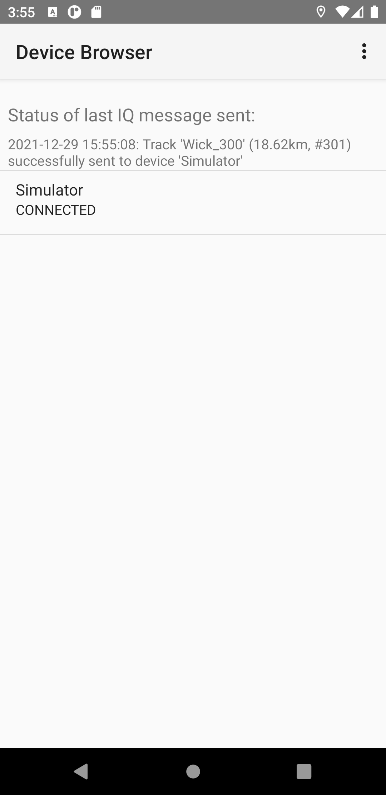

{::options parse_block_html="true" /}

- Menu item 'Send selected to device' opens device browser with list of Garmin devices
- Shows status of last sent
- Click on device entry opens dialog to send selected track/route to connected device

{::options parse_block_html="true" /}

##### Send to device dialog

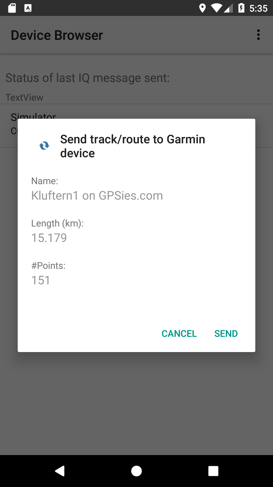

{::options parse_block_html="true" /}

- Optionally set maximum number of waypoints and maximum error (may be set by default settings)
- Click on 'Send' button to send selected track/route to Garmin device
- Wait for last sent status message on Device Browser screen. Note that sending via bluetooth may take a few seconds.
- On success, the track is stored on the Garmin device and ready for use with the WormNav app

{::options parse_block_html="true" /}

### Connect IQ app

#### Key features and capabilities:
- Show track and current position
- Start/stop/save activity
- Configurable auto lap
- Configurable 'bread crumbs' (i.e. trace)
- Zoom in/out of map with showing scale
- Show position or track in view center
- Fixed north or heads-up map orientation

#### Button usage
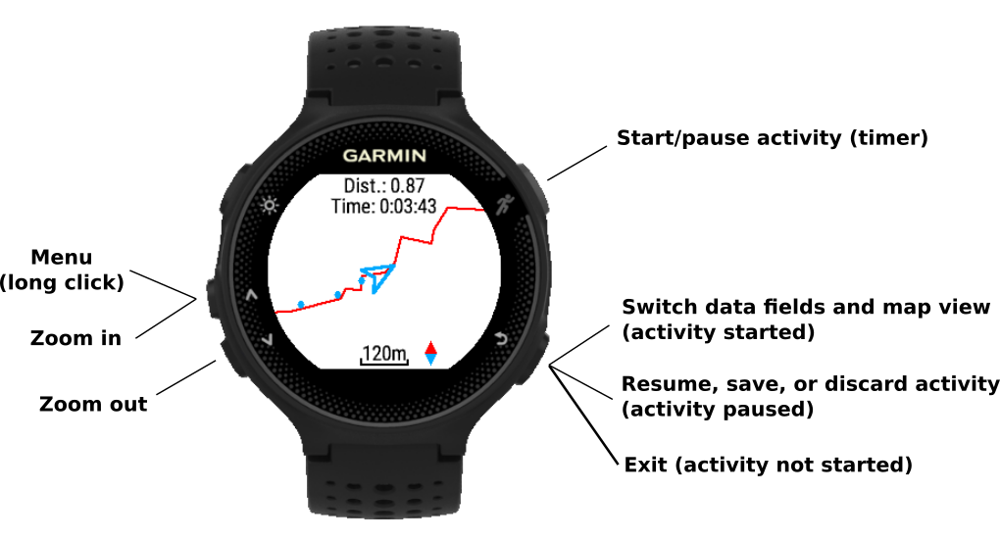

Vivoactive has a touch screen. All operations perform on touch screen rather then button.
- tap: start/pause activity
- long tap: menu
- swipe up/down: zoom out/in
- swipe right: 
  - switch data fields and map view (when activity started)
  - Resume, save or discard activity (when activity paused)
  - Exit (when activit not started)

#### Screens

##### Main menu

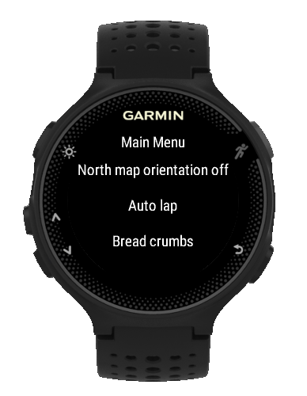

{::options parse_block_html="true" /}

Available menu items:
- Map orientation (north or heads-up)
- Auto lap distance (0 means off)
- Bread crumbs distance (0 means off)
- Track center view on/off
- Delete track

{::options parse_block_html="true" /}

##### Map view (north map orientation)

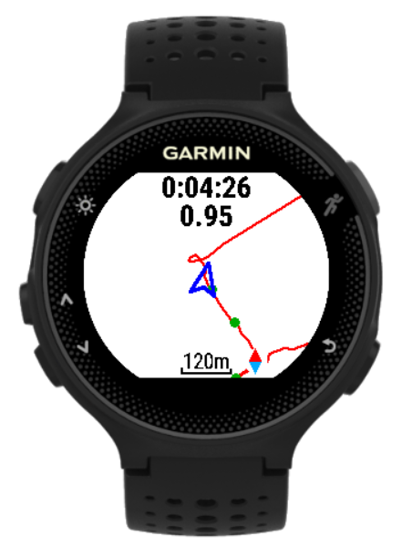

{::options parse_block_html="true" /}

Standard view of map/track when activity has started
- Elapsed time and distance shown on top
- Track is shown as red line with north in up-direction
- Position cursor points into direction of movement 
- Bread crumbs are shown as blue filled circles
- Scale and compass at bottom

{::options parse_block_html="true" /}

##### Map view (heads-up)

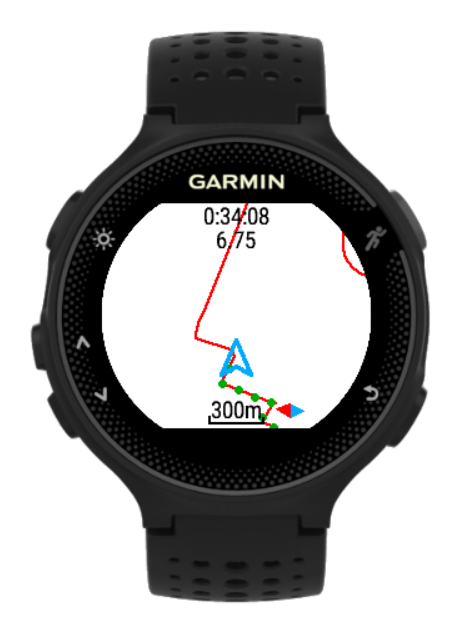

{::options parse_block_html="true" /}

Heads-up view of map/track
- Position cursor has fixed up-orientation  
- Track and compass are rotated according to actual direction of movement  

{::options parse_block_html="true" /}

##### Map view (track centered)

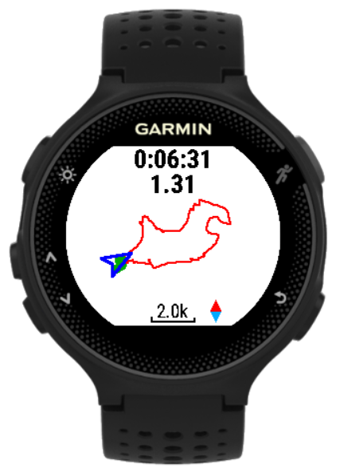

{::options parse_block_html="true" /}

Show track and current position with center of track as view center
- North is always in up-direction
- Useful for getting an overview of current position in relation to the track
- Zoom in/out possible

{::options parse_block_html="true" /}

##### Data page

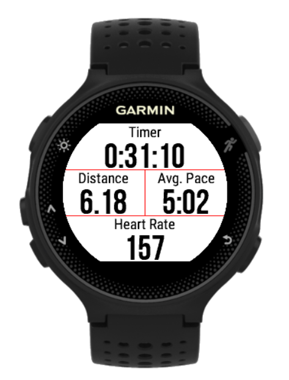

{::options parse_block_html="true" /}

Data page with 4 fixed data fields
- Elapsed time
- Elapsed distance in km
- Average pace in min/km
- Heart rate (if sensor exists and activated)

{::options parse_block_html="true" /}

