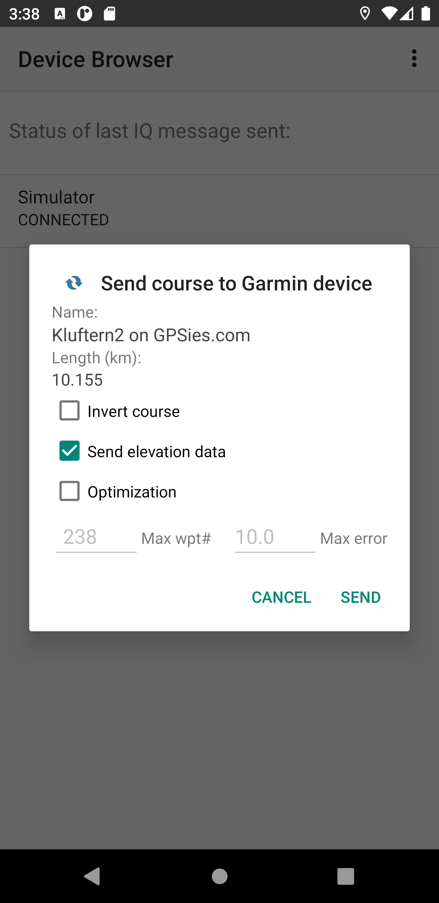
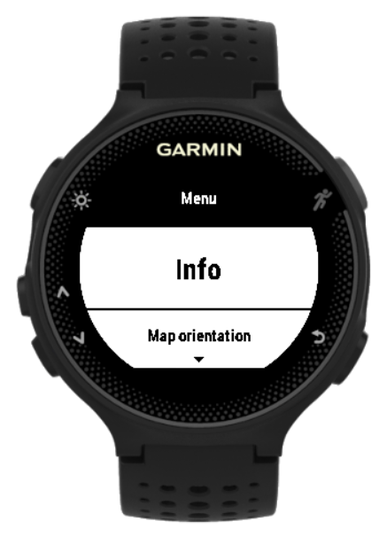

WormNav User Guide
===================================

WormNav is a ConnectIQ app for a number of Garmin wearables that allows an autonomeous 
navigation along a given course (track/route). The 'worm' refers to the fact that only the course is displayed on the device screen as one dimensional line along with the current position cursor. This type of navigation should be good enough for many scenarios to safely follow a course in an unknown terrain.

The course data is created by an Android companion app and tranmitted via Bluetooth to the Garmin wearable.

WormNav is mainly targeted at those Garmin wearables which do not have a built-in course feature and include
- Forerunner 23x, 245, 6xx, 735xt
- vivoactive series
- Venu series

# Installation and basic set-up
- Install [Garmin Connect™ app](https://play.google.com/store/apps/details?id=com.garmin.android.apps.connectmobile) from Google Play Store (pre-requisite)
- Install [WormNav Companion app](https://play.google.com/store/apps/details?id=org.andan.android.connectiq.wormnav) from Google Play Store on your Android smartphone or tablet
- Install [WormNav app](https://apps.garmin.com/de-DE/apps/07c0363a-a921-4c77-bb4f-93a6d6c4a2ed) from Connect IQ Store
- Connect your Gamin device with your Android device via bluetooth

# Typical usage scenario
1. Choose or create a GPX track or route which you want to follow with your Garmin wearable
2. Import this track/route into WormNav Companion app
3. Optionally optimize the track/route to reduce number of waypoints
4. Connect your Garmin wearable with your smartphone/tablet via Bluetooth
4. Send track/route to connected Garmin wearable
5. Start WormNav app on Garmin wearable
6. Start activity and follow track shown on display of the Garmin wearable
7. Stop/resume/save activity

# Companion app

## Key features and capabilities:
- Load GPX tracks and routes
- Show GPX tracks or routes in Open Street map
- Create routes
- Optimize routes (reduce number of waypoints given maximum error contraint)
- Merge tracks/routes
- Store tracks and routes
- Send track/route to connected Garmin wearable

## Screens

### Main screen
{::options parse_block_html="true" /}

{::options parse_block_html="true" /}

- Note: On first run the app will ask for granting STORAGE and LOCATION permissions
- Settings from three dot menu (upper right corner) with following options:
  - Save loaded GPX data into internal backup file on exit
  - Load data from internal backup into app on start
  - Default metrics, elevation data and optimization configuration
- Manage loaded GPX tracks, routes, or points of interest (see below)
- Open GPX file to load possibly multiple tracks or routes
- Save all loaded tracks/routes into file

{::options parse_block_html="true" /}

### Track/Route Manager

{::options parse_block_html="true" /}

- Show loaded tracks or routes on OpenStreet Map
- Select track/route by using arrows at screen buttom
- Use three dot menu to apply functions (see below)

{::options parse_block_html="true" /}

### Track/Route Manager - Menu & Import

{::options parse_block_html="true" /}

- Apply functions to manage, change, or import or export tracks/routes 

{::options parse_block_html="true" /}

### Track Manager - Convert

{::options parse_block_html="true" /}

- Converts tracks into routes
- Optionally merge selected tracks into a single route
- Optionally optimize route

{::options parse_block_html="true" /}

### Route Manager - Optimize

{::options parse_block_html="true" /}

- Optimize route by reducing number of waypoints
- Shows maximum error caused by optimization
- Useful to speed-up performance and reduce memory consumption
- Recommendation for Garmin Forerunner 230/235: max 250 waypoints
- Tracks must be converted into routes for optimization

{::options parse_block_html="true" /}

### Device Browser

{::options parse_block_html="true" /}

- Menu item 'Send selected to device' opens device browser with list of Garmin devices
- Shows status of last sent
- Click on device entry opens dialog to send selected track/route to connected device (see below)
- Shows log of last transmissions via menu entry

{::options parse_block_html="true" /}

### Send to device dialog

{::options parse_block_html="true" /}

- Optionally set maximum number of waypoints and maximum error (may be set by default settings)
- Click 'SEND' button to send selected track/route to Garmin device
- Wait for last sent status message on Device Browser screen (may take few seconds)
- On success, the track is stored on the Garmin device and ready for use with the WormNav app

{::options parse_block_html="true" /}

# Connect IQ app

## Key features and capabilities:
- Show course and current position
- Optionally show elevation profile with current position and elevation
- Start/stop/save activity
- Set activity type
- Configurable auto lap
- Configurable 'breadcrumb' tracking
- Configurable data screens
- Zoom in/out of map with showing scale
- Show position or course in view center
- Fixed north or heads-up map orientation
- Support for external heart rate monitor

## Button usage

For devices with touch screen use following gestures:
- Single tap: start/pause activity
- Long tap: menu
- Swipe up/down: zoom out/in or previous/next data screen
- Swipe right: 
  - Switch data fields and map view (when activity started)
  - Resume, save or discard activity (when activity paused)
  - Exit (when activity not started)

## Screens

### Control Menu

{::options parse_block_html="true" /}

Available (sub-) menu items
- **Info** Shows infos about app and loaded course
- **Map orientation** Set orientation/view of course
  - **Track up** Up points to track/movement direction
  - **North up** Up points to north direction
  - **Centered** Up points to north direction with course center as view center
- **Breadcrumbs**
  - **Set current pos** Set current position as breadcrumb marker
  - **Clear** Clear all breadcrumb markers
  - **Number** Set maximum number of breadcrumb markers
  - **Distance** Set distance to automatically set breadcrumb markers
- **Auto lap** Set distance for auto lap
- **Activity type** Set type of activity
- **Course**
  - **Large font** Enable/disable large font for show activity data shown on top of course or profile view
  - **Show profile** Enable/disable show course profile if elevation data exist
  - **Store** Store loaded course data into app storage on exit
  - **Update period** Set update period of course view (larger periods might result in reduced power consumption)
  - **Delete:** Delete loaded course
- **Data fields:** Set data screens and fields, see below

{::options parse_block_html="true" /}

### Course view (North up orientation)

{::options parse_block_html="true" /}

Standard course view when activity has started:

- Elapsed time and distance shown on top (data and font size are configurable)
- Course is shown as red line with north in up-direction
- Position cursor points into direction of movement 
- Breadcrumbs are shown as green filled circles
- Scale and compass at bottom

{::options parse_block_html="true" /}

### Course view (Track up orientation)

{::options parse_block_html="true" /}

Track-up view of course

- Position cursor has fixed up-orientation  
- Course and compass are rotated according to actual direction of movement  

{::options parse_block_html="true" /}

### Course view (Centered)

{::options parse_block_html="true" /}

Shows track and current position with center of course as view center

- North is always in up-direction
- Useful for orientation purposes
- Zoom in/out possible

{::options parse_block_html="true" /}

### Data screen

{::options parse_block_html="true" /}

Up to 4 data fields can be configured for each of the three data and the course screen. 
Data screens with zero number of fields are not displayed.
Available data fields are:

- Time: total/lap/last lap time in hh:mm:ss
- Distance: total/lap/last lap distance in km
- Pace: current/average/lap/last lap pace in mm:ss/km
- Speed: current/average/lap/last lap speed in km/h
- Altitude: current/total ascent/total descent
- Heart rate: current/average heart rate in bpm and % of max (if sensor exists and activated)
- System: clock time, battery level

{::options parse_block_html="true" /}

### Profile screen

{::options parse_block_html="true" /}

Shows course profile and current position data. This screen is only shown if elevation data is available (check Info menu).

The specfic elements of this screen are:
- Elevation profile with minimum/maximum elevation and total ascent (^) values at right vertical axis
- Course length below horizontal axis
- Current position as vertical blue line
- Current elevation and recorded total ascent values (from activity) at left vertial axsis (blue)
- Current passed distance from start of course in blue below (fixed) course length

{::options parse_block_html="true" /}

# Important notes and limitations
- Use of the app for navigation is at your own risk
- The number of course points heavily impacts the memory and power consumption as well as the performance (screen refresh rate) of the app
- For the Forerunner 235, the following limits and performance figures have been determined   
  - Maximum number of points: ~300 with or ~450 without elevation data
  - For a 300 points course with elevation data:
    - Course view: refresh time ~370ms with power consumption ~8.5% per hour
    - Profile view: refresh time ~870ms with power consumption ~13% per hour
- For other, especially newer devices the limitations and performance figures might be much higher
- It is highly recommended to use the optimize feature of the companion app for tracks/routes with large number of points. A maximum error of ~10m induced by the optimization process should be good enough for many use cases.
- On Forerunner 235 and likely with other older and low spec Garmin devices, the transmission or storage of courses with large number of points might fail. If an optimization is not possible, the limit can be extended by deleting a loaded course from the app (from Course menu).
- If the course profile view is active, the point on the course that is nearest to the current position is determined by a projection method. This expensive procedure explains the lower refresh rate and higher power consumption compared to the course view. Note that the current position might still be at a large distance from the course, which would make the current elevation and distance data potentially very inaccurate. The actual distance can be assessed from the course view. Also the passed distance can be wrong at start or end at round courses and in general at course segments which are close to each other.