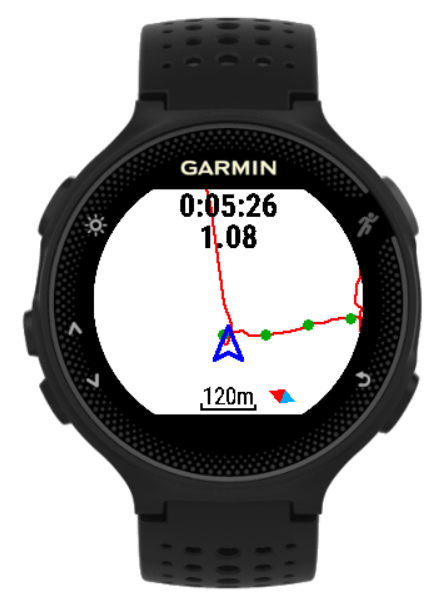

WormNav
===================================

## User Guide

This project provides a simple 'worm' navigation feature for selected Garmin devices.
It consists of two apps:
- An Android companion app to manage GPX tracks and routes and send them to the Garmin device via bluetooth.
- The ConnectIQ app for the Garmin device to navigate along the track and run activities.

### Installation and basic set-up
- Pre-requisiste: Installation of [Garmin Connect™ app](https://play.google.com/store/apps/details?id=com.garmin.android.apps.connectmobile) from Google Play Store
- Install [WormNav Companion app](https://play.google.com/store/apps/details?id=org.andan.android.connectiq.wormnav) from Google Play Store on your Android smartphone or tablet
- Install [WormNav app](https://apps.garmin.com/de-DE/apps/07c0363a-a921-4c77-bb4f-93a6d6c4a2ed) from Connect IQ Store
- Connect your Gamin device with your Android device via bluetooth

### Typical usage scenario
1. Choose or create a GPX track or route for navigation on your Garmin device
2. Import this track/route into WormNav Companion app
3. Optionally optimize the track/route to reduce number of waypoints
4. Connect your Garmin device with your smartphone/tablet via bluetooth
4. Send optimized track/route to connected Garmin device
5. Start WormNav app on Garmin device
6. Start activity and follow track shown on display of the Garmin device
7. Stop/resume/save activity

### Companion app

#### Key features and capabilities:
- Load GPX tracks and routes
- Show GPX tracks or routes in Open Street map
- Optimize routes (reduce number of waypoints given maximum error contraint)
- Merge tracks/routes
- Store tracks and routes
- Send track/route to connected Garmin device

#### Screens

##### First run/Main screen
{::options parse_block_html="true" /}

{::options parse_block_html="true" /}

- On first run the app will ask for granting two permissions (STORAGE and LOCATION)
- Main functions available from the main screen:
    - Manage settings
      - Save loaded GPX data into internal backup file on exit
      - Load data from internal backup into app on start
      - Default metrics and optimization configuration
    - Open or save GPX file with possibly multiple tracks or routes
    - Manage loaded GPX tracks, routes, or points of interest (see below)

{::options parse_block_html="true" /}

##### Track/Route Manager - Import

{::options parse_block_html="true" /}

- Import GPX tracks or routes
- Delete loaded GPX tracks or routes
- The 'Save file' function will save all loaded tracks and routes into a single GPX file

{::options parse_block_html="true" /}

##### Track/Route Manager - Show tracks/routes on map

{::options parse_block_html="true" /}

- Show loaded tracks or routes on OpenStreet Map
- Select track/route by using arrows at screen buttom

{::options parse_block_html="true" /}

##### Track Manager - Convert

{::options parse_block_html="true" /}

- Converts tracks into routes
- Optionally merge selected tracks into a single route
- Optionally optimize route

{::options parse_block_html="true" /}

##### Route Manager - Optimize

{::options parse_block_html="true" /}

- Optimize route by reducing number of waypoints
- Shows maximum error caused by optimization
- Useful for performance reasons on low spec devices
- Recommendation for Garmin Forerunner 230/235: max 200 waypoints
- Tracks must be converted into routes for optimization

{::options parse_block_html="true" /}

##### Device Browser

{::options parse_block_html="true" /}

- Menu item 'Send selected to device' opens device browser with list of Garmin devices
- Shows status of last sent
- Click on device entry opens dialog to send selected track/route to connected device
- Shows log of last transmissions via menu entry

{::options parse_block_html="true" /}

##### Send to device dialog

{::options parse_block_html="true" /}

- Optionally set maximum number of waypoints and maximum error (may be set by default settings)
- Click on 'Send' button to send selected track/route to Garmin device
- Wait for last sent status message on Device Browser screen. Note that sending via bluetooth may take a few seconds.
- On success, the track is stored on the Garmin device and ready for use with the WormNav app

{::options parse_block_html="true" /}

### Connect IQ app

#### Key features and capabilities:
- Show track and current position
- Start/stop/save activity
- Set activity type
- Configurable auto lap
- Configurable 'breadcrumb' tracking
- Configurable data screens
- Zoom in/out of map with showing scale
- Show position or track in view center
- Fixed north or heads-up map orientation
- Support for external heart rate monitor

#### Button usage

For devices with touch screen use following gestures:
- single tap: start/pause activity
- long tap: menu
- swipe up/down: zoom out/in or previous/next data screen
- swipe right: 
  - Switch data fields and map view (when activity started)
  - Resume, save or discard activity (when activity paused)
  - Exit (when activity not started)

#### Screens

##### Control Menu

{::options parse_block_html="true" /}

Available (sub-) menu items

- **Map orientation** Set orientation/view of course

    - **Track up** Up points to track/movement direction
    - **North up** Up points to north direction
    - **Centered** Up points to north direction with track center as view center
- **Breadcrumbs**
    - **Set current pos** Set current position as breadcrumb marker
    - **Clear** Clear all breadcrumb markers
    - **Number** Set maximum number of breadcrumb markers
    - **Distance** Set distance to automatically set breadcrumb markers
- **Auto lap** Set distance for auto lap
- **Activity type** Set type of activity
- **Course**
    - **Update period** Set update period of track view (larger periods might result in reduced power consumption)
    - **Info:** shows basic track information)
    - **Delete:** delete track)
- **Data fields:** Set data screens and fields, see below

{::options parse_block_html="true" /}

##### Map view (North up orientation)

{::options parse_block_html="true" /}

Standard view of map/track when activity has started:

- Elapsed time and distance shown on top
- Track is shown as red line with north in up-direction
- Position cursor points into direction of movement 
- Breadcrumbs are shown as green filled circles
- Scale and compass at bottom

{::options parse_block_html="true" /}

##### Map view (Track up orientation)

{::options parse_block_html="true" /}

Track-up view of map/track

- Position cursor has fixed up-orientation  
- Track and compass are rotated according to actual direction of movement  

{::options parse_block_html="true" /}

##### Track view (Map centered)

{::options parse_block_html="true" /}

Shows track and current position with center of track as view center

- North is always in up-direction
- Useful for getting an overview of current position in relation to the track
- Zoom in/out possible

{::options parse_block_html="true" /}

##### Data screen

{::options parse_block_html="true" /}

Up to 4 data fields can be configured for each of the three data and the track screen. 
Data screens with zero number of fields are not displayed.
Available data fields are:

- Time: total/lap/last lap time in hh:mm:ss
- Distance: total/lap/last lap distance in km
- Pace: current/average/lap/last lap pace in mm:ss/km
- Speed: current/average/lap/last lap speed in km/h  
- Heart rate: current/average heart rate in bpm and % of max (if sensor exists and activated)
- System: clock time, battery level

{::options parse_block_html="true" /}

